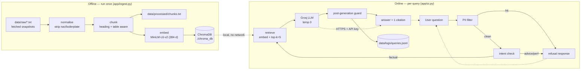
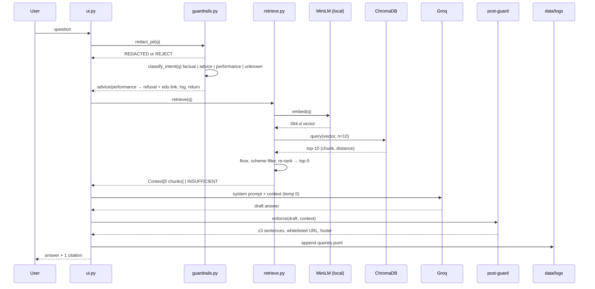

# Architecture — Mutual Fund Facts-Only RAG Chatbot

**Companion to:** [`PRD.md`](PRD.md) · **Brief:** [`doc/problemstatement.txt`](doc/problemstatement.txt)
**Status:** Draft v1 · **Last updated:** 2026-09-28

This document turns the PRD's requirements into a concrete technical design: components, data contracts, control flow, and the decisions that were left open in the PRD. Requirement IDs (`FR-x.y`) refer back to `PRD.md` §5.

---

## 1. Design principles

1. **Ingestion is offline and versioned.** The vector index is built once by an explicit command. Nothing in the query path touches the network except the single LLM call. (FR-1.1, FR-1.5)
2. **The model is never allowed to be the source of truth.** Every fact must be present in a retrieved chunk; every URL must be copied from chunk metadata, not generated. The LLM only rephrases and stitches.
3. **Policy is enforced in code, not in prose.** Prompt instructions are necessary but not sufficient; a post-generation guard is the actual enforcement point. (FR-4.4, FR-5)
4. **Fail safe to "I don't know."** Every confidence gap — low similarity, missing key, LLM error, hallucinated URL — has a defined non-fabricating fallback.
5. **Everything is inspectable.** Chunks, retrieval hits, prompts, and answers are all written to readable files for demo and debugging.
6. **Local first.** Embeddings and vector store run on CPU with no API key; only Groq is remote.

---

## 2. System context



The only network dependency in the online path is the Groq call. Embeddings and search are local, so the demo degrades gracefully offline (see §10).

---

## 3. Repository layout

```
chatbot/
├─ app/
│  ├─ __main__.py        # `python -m app` — boots the UI
│  ├─ ingest.py          # FR-1  load → normalise → chunk → embed → store   (CLI)
│  ├─ retrieve.py        # FR-3  embed query, search, floor, re-rank
│  ├─ generate.py        # FR-4  prompt build, Groq call, post-guard
│  ├─ guardrails.py      # FR-5  PII, intent, refusal templates
│  ├─ ui.py              # FR-6  chat UI
│  ├─ config.py          # paths, model ids, constants, k, temperature
│  └─ prompts.py         # system prompt + answer template (single source of truth)
├─ scripts/
│  ├─ fetch_sources.py   # one-time manual fetch into data/raw/ (allow-list enforced)
│  └─ eval.py            # FR-7.3 retrieval + citation accuracy report
├─ data/
│  ├─ raw/               # versioned source snapshots, checked in
│  ├─ processed/
│  │  └─ chunks.txt      # FR-1.3 human-readable chunk dump
│  └─ logs/
│     └─ queries.jsonl   # FR-7.1
├─ docs/
│  └─ chunking_strategy.md
├─ samples/
│  ├─ qa.md              # 5–10 Q&A with links
│  └─ disclaimer.txt
├─ tests/                # guardrail + retrieval unit tests
├─ chroma_db/            # persisted collection (git-ignored)
├─ sources.md
├─ README.md
├─ requirements.txt
├─ .env.example
├─ .gitignore            # .env, chroma_db/, __pycache__/
├─ PRD.md
└─ architecture.md
```

**Dependency direction is strictly one-way:** `ui → generate → retrieve → config`, `ui → guardrails`, and `ingest` shares only `config` + `chunks` helpers. `retrieve` and `generate` never import `ingest`, and nothing in the online path imports the fetch script.

---

## 4. Ingestion pipeline (FR-1)

### 4.1 Stage-by-stage

| Stage | Input | Output | Notes |
|-------|-------|--------|-------|
| 0. Fetch | Live URLs (manual run) | `data/raw/<scheme>/<source_type>-<as_of>.txt` | `scripts/fetch_sources.py`. Domain allow-list = HDFC AMC, AMFI, SEBI (+ explicitly-labelled reference pages). Not part of the app. |
| 1. Load | `data/raw/**` | list of raw documents | Stable ordering by filename so `chunk_id`s are reproducible. |
| 2. Normalise | raw HTML/text | clean text | Drop nav/cookie/footer boilerplate, collapse whitespace, flatten tables to `Label: value` lines, normalise dashes/quotes, strip zero-width chars. |
| 3. Chunk | clean text | `list[Chunk]` | §4.2 |
| 4. Dump | `list[Chunk]` | `data/processed/chunks.txt` | Deterministic serialisation, one block per chunk with metadata header. |
| 5. Embed | `list[Chunk]` | `list[vector]` | Batch of 64, `normalize_embeddings=True`. |
| 6. Store | vectors + metadata | Chroma collection | Idempotent upsert keyed on `chunk_id`. |

### 4.2 Chunking strategy (FR-2)

The PRD requires the strategy to be chosen *after* inspecting the corpus. Design here, validated in `docs/chunking_strategy.md`:

**Why not a blind fixed-window splitter.** MF fact sheets are structured documents. The highest-value facts — exit-load slabs, expense-ratio rows, ELSS lock-in clauses, riskometer level, benchmark name — live in short self-contained units, often in tables. A character-window splitter cuts mid-row, producing chunks like `1.50%` with no label. MiniLM then embeds a context-free fragment that retrieves poorly *and* answers dangerously. The strategy is therefore **structure-first, size-bounded**.

**Algorithm** (`app/chunking.py`):

```
1. Parse the document into a section tree (h1/h2/h3 or numbered headings).
2. Walk sections in order, emitting paragraphs and table rows as atomic units.
3. Group consecutive units into a chunk until adding the next would exceed CHUNK_SIZE.
4. Never break inside a table row or a sentence when a legal break exists nearby.
5. Emit the next chunk with TAIL_OVERLAP trailing characters of context.
6. Prepend the context prefix (scheme + section) to the embedded text.
```

| Parameter | Value | Rationale |
|-----------|-------|-----------|
| `CHUNK_SIZE` | 900 chars | Holds a fee table plus header/labels, or ~2 short paragraphs. Keeps 5 retrieved chunks well inside the context window. |
| `TAIL_OVERLAP` | 150 chars | Carries the preceding sentence/section header across the boundary so a split clause stays interpretable. Below ~100 the overlap adds noise; above ~250 it duplicates fee rows. |
| `MIN_CHUNK` | 80 chars | Merge or drop orphan fragments (single labels, page numbers). |
| Hard separators | `\n\n` → `\n` → sentence boundary → ` ` | Recursive splitting; preserves natural prose boundaries. |
| Protected units | table rows, numbers with units (`%`, `Rs.`, `years`, `bps`) | Never split a number from its label. |

**Context prefix.** Each chunk's *embedded* text is prefixed with e.g. `HDFC Large Cap Fund – Direct – Growth | Exit load and charges: `, while the *stored* text stays clean. MiniLM is context-poor; the prefix measurably improves recall for scheme-specific queries, and does not leak into the answer.

### 4.3 Chunk contract (FR-1.6)

```python
@dataclass(frozen=True)
class Chunk:
    chunk_id: str          # f"{corpus_version}:{source_slug}:{chunk_index:04d}"  — stable across runs
    text: str              # clean chunk text (no prefix), as shown in chunks.txt
    embed_text: str        # context_prefix + text  (what gets embedded)
    # --- metadata, mirrored into Chroma ---
    scheme: str            # "HDFC Large Cap Fund – Direct – Growth"
    scheme_slug: str       # "hdfc-large-cap"
    amc: str               # "HDFC AMC"
    category: str          # large_cap | flexi_cap | elss | small_cap | balanced_advantage | general
    source_type: str       # factsheet | kim | sid | scheme_faq | fees | riskometer | guide | reference_page
    source_title: str
    source_url: str
    section: str           # "Exit load", "Expense ratio", "Tax statement"
    chunk_index: int
    as_of_date: str | None # "2025-06-30" when the source states it
    fetched_at: str        # ISO-8601
    corpus_version: str    # e.g. "2026-09-28.1"
```

`chunks.txt` is written in exactly this shape so a human can audit the corpus before the demo:

```
================================================================================
chunk_id : 2026-09-28.1:hdfc-large-cap-factsheet:0007
scheme   : HDFC Large Cap Fund – Direct – Growth
type     : factsheet          section: Exit load
as_of    : 2025-06-30
url      : https://www.hdfcassetmanagement.com/.../hdfc-large-cap-factsheet.pdf
--------------------------------------------------------------------------------
Direct plan: nil. The scheme does not levy an exit load. ...
```

### 4.4 Vector store (FR-1.4, FR-1.5)

| Property | Value | Why |
|----------|-------|-----|
| Backend | ChromaDB, `PersistentClient(path=./chroma_db)` | Persists to disk; no server to run. |
| Collection | `mf_facts_<corpus_version>` | Version in the name ⇒ a new corpus never silently mixes with old vectors. |
| Distance | `hnsw:space = "cosine"` on **L2-normalised** embeddings | Cosine + normalisation makes the distance directly a relevance score in `[0, 1]`; default L2 is not comparable across chunks. |
| IDs | `chunk_id` | `upsert` ⇒ re-running ingestion is idempotent. |
| Documents/metadata | `text`, all fields from §4.3 | `None` is not storable → absent dates are stored as `""`. |
| Write policy | Ingest writes. Query path only reads. | Removes any chance of the app mutating the index. |

Index freshness: `chroma_db/` is git-ignored; a `corpus_version` mismatch between the store and `data/raw/` prints a clear "run `python -m app.ingest`" message at startup instead of silently answering from a stale index.

---

## 5. Query pipeline

### 5.1 Sequence



### 5.2 Guardrail stage (FR-5)

Ordered cheapest-first so the LLM is never paid for a request we will refuse anyway.

| Order | Check | Input signal | Action |
|-------|-------|--------------|--------|
| 1 | **PII** (FR-5.4) | Regex: PAN `[A-Z]{5}[0-9]{4}[A-Z]`, Aadhaar `\b\d{4}\s?\d{4}\s?\d{4}\b`, email, phone (`+91` / 10-digit with optional separators), OTP keywords, account-no keywords | If a high-confidence pattern matches → reject with a neutral message: *"I can't accept personal identifiers. Please rephrase without PAN, Aadhaar, account number, phone, or email."* **Do not echo the value back.** Nothing is written to the log — only `{pii_rejected: true, len: 42}`. |
| 2 | **Advice intent** (FR-5.1) | Phrase list: *should I buy / sell / hold, which is better, is now a good time, how much should I invest, build me a portfolio, best fund for me, worth investing* | Refusal + SEBI/HDFC education link. |
| 3 | **Performance intent** (FR-5.3) | *returns, CAGR, XIRR, performance, which performed best, vs. Nifty* | Do not compute. Answer with the official factsheet link for the relevant scheme. |
| 4 | **Unknown / out of scope** | Not in the 5-scheme corpus (e.g. a different AMC) | "I only have sources for these HDFC AMC schemes" + link to the general page. |

The classifier is an explicit rule table, not a model call: it is inspectable, deterministic, free, and testable. A semantic check on the retrieved chunks is the secondary defence (a refusal-triggering intent detected post-retrieval is logged and surfaced in eval).

### 5.3 Retrieval (FR-3)

```
1. q_vec = model.encode([question], normalize_embeddings=True)     # same model as ingest
2. hits  = collection.query(query_embeddings=[q_vec], n=10)         # over-fetch for rerank
3. if max(hits) is None                              -> INSUFFICIENT
4. hits = [h for h in hits if similarity(h) >= 0.30]                # cosine floor
5. hits = filter_to_known_schemes(hits) if the question names a scheme
6. if len(hits) == 0                                -> INSUFFICIENT
7. hits = rerank(question, hits)[:TOP_K]             # TOP_K = 5
```

**On the 0.30 floor.** MiniLM cosine similarities on a small, tightly-scoped corpus are compressed into a narrow band; a 0.30 floor is a *starting value to be tuned against the eval set* and is recorded in `docs/chunking_strategy.md` once measured. It exists to catch the "question about a scheme we don't have" case, not to be a precision guarantee. The floor is a config constant, never a magic number buried in code.

**On scheme filtering.** If the question names a scheme (matched against `scheme_slug` aliases), chunks from other schemes are demoted. This is what stops "expense ratio of HDFC Small Cap" from being answered with the Large Cap factsheet. If the filter empties the result set, we return INSUFFICIENT rather than falling back to other schemes' numbers.

**Re-rank (FR-3.4, "Should").** Lexical overlap on question terms against chunk text, boosting chunks that contain a scheme name, a metric term (`expense ratio`, `exit load`, `SIP`, `lock-in`, `riskometer`, `benchmark`), and the source type most likely to hold the answer (`fees` for charges, `guide` for "how do I download"). Deliberately simple: no extra model to install, and its effect is visible in the demo's "sources" expander.

**INSUFFICIENT behaviour (FR-3.3).** A deterministic message naming what is *not* covered plus the general HDFC MF link. No LLM call, no fabrication. This is the path for target question 7 in the PRD appendix.

### 5.4 Prompt (FR-4.2)

Single source of truth in `app/prompts.py`, so the demo can print exactly what was sent.

```
SYSTEM
You are a factual assistant for HDFC Asset Management Company's mutual fund schemes.
You answer ONLY from the CONTEXT below. The context is the entire universe of
facts you have. If a fact is not in the context, say so plainly.

Hard rules:
1. Answer with at most 3 sentences. No preambles, no bullet lists, no markdown.
2. Include EXACTLY ONE source URL in the answer, copied character-for-character
   from the `url` field of the context block it came from. Never write, guess,
   shorten, or combine a URL. If the chunks disagree, cite the one you used.
3. End with exactly this line:
   Last updated from sources: {as_of_date}
4. Never give investment advice, recommendations, opinions, or comparisons.
5. Never state, compute, or imply returns, CAGR, or performance. If asked,
   say the figures live in the official factsheet.
6. If the context does not contain the answer, reply exactly:
   I couldn't find that in my sources.
   Last updated from sources: {as_of_date}

USER
{question}

CONTEXT
[1] scheme=... | section=... | as_of=... | url=...
{chunk_text}
[2] ...
```

`{as_of_date}` is resolved as the most recent non-empty `as_of_date` among retrieved chunks; if none carry one, the string is the corpus `fetched_at` date. The footer is therefore never omitted, and it is independently verified by the post-guard.

Model settings: `temperature=0`, `max_tokens≈220`, single user message, no few-shot examples in the hot path (the deterministic template is faster and easier to defend in the demo).

### 5.5 Post-generation guard (FR-4.4)

Runs on the raw LLM string. Anything it catches is logged with the reason.

| Check | Rule | On failure |
|-------|------|-----------|
| URL integrity | Extract all URLs; keep only those present in the retrieved chunks' `source_url` set; if none survive, substitute the top-ranked chunk's URL; if >1 distinct survive, keep the first and drop the rest. | replace / trim |
| Sentence cap | Split on `.?!` boundary after sentence 3 and truncate at 3. | truncate |
| Footer present | Must contain `Last updated from sources:`; append if missing. | append |
| Advice leakage | Scan for recommendation verbs (*buy, sell, hold, invest in, recommend, advisable*). | regenerate once with a stricter instruction; if it fails again, fall back to the deterministic refusal. |
| Non-empty / length | `< 15` chars or truncated mid-token | treat as LLM failure → §10 fallback |

### 5.6 Response shape (FR-6.3)

```json
{
  "answer": "…max 3 sentences… Last updated from sources: 2025-06-30",
  "citation": { "label": "HDFC AMC — HDFC Large Cap Fund Factsheet (Jun 2025)", "url": "https://…" },
  "kind": "answer" | "refusal" | "insufficient" | "pii_rejected",
  "sources": [ { "chunk_id": "…", "section": "…", "url": "…", "score": 0.71 } ],
  "latency_ms": { "embed": 90, "search": 25, "llm": 1100, "total": 1215 }
}
```

`citation` is a structured field, not parsed out of prose — the UI renders a real link, so a mangled URL in the LLM text can never reach the browser. `sources` feeds the demo's sources expander, which is how we *show* that retrieval is real rather than assert it.

---

## 6. Log schema (FR-7.1)

`data/logs/queries.jsonl`, one JSON object per line, append-only:

```json
{"ts":"2026-09-28T14:03:11Z","q":"Expense ratio of HDFC Small Cap?","q_sha":"ab12…",
 "intent":"factual","refused":false,"pii_rejected":false,
 "hits":[{"chunk_id":"…","score":0.71,"section":"Fees"}],
 "answer":"…","citation_url":"https://…","guards":{"url_ok":true,"cap_ok":true,"footer_ok":true},
 "model":"groq/…","corpus_version":"2026-09-28.1","latency_ms":{"total":1215}}
```

The question text is hashed as well as stored, so we can dedupe and audit without accumulating user text. No PII is ever written (check 1 in §5.2 runs before logging). This file is the evidence base for `scripts/eval.py` and for the demo's "how we know it works" slide.

---

## 7. Configuration

`app/config.py` reads env with defaults; nothing is hard-coded in logic.

| Setting | Env var | Default | Notes |
|---------|---------|---------|-------|
| Groq key | `GROQ_API_KEY` | — | Required for the query path only. Never logged, never committed. Missing → UI shows a clear setup message, ingest still works. |
| Groq model | `GROQ_MODEL` | `llama-3.1-8b-instant` | Confirm against the Groq console before the demo. |
| Temperature | `GROQ_TEMPERATURE` | `0.0` | |
| Chroma path | `CHROMA_PATH` | `./chroma_db` | |
| Collection | `CHROMA_COLLECTION` | `mf_facts_{corpus_version}` | |
| Embedding model | `EMBED_MODEL` | `sentence-transformers/all-MiniLM-L6-v2` | Must match ingest or vectors are incomparable. |
| Top-k | `TOP_K` | `5` | |
| Over-fetch | `FETCH_K` | `10` | |
| Similarity floor | `SIM_FLOOR` | `0.30` | Tune on the eval set. |
| Chunk size / overlap | `CHUNK_SIZE` / `TAIL_OVERLAP` | `900` / `150` | |
| Max context chars | `MAX_CONTEXT_CHARS` | `8000` | Hard stop so a pathological query cannot blow the context window. |

`.env.example` ships the keys with empty values; `.gitignore` contains `.env`, `chroma_db/`, `data/logs/`, `__pycache__/`, `.venv/`.

---

## 8. Failure modes

| Failure | Detection | Behaviour |
|---------|-----------|-----------|
| Missing `GROQ_API_KEY` | Config load | UI banner: setup instructions. Ingest/retrieval unaffected. |
| Groq rate limit / 5xx / timeout | Client exception + retry (1 backoff) | Deterministic fallback: show the top retrieved chunk's text, truncated, with its citation. Degrades to "retrieval-only mode" — still cited, still useful, no fabrication. |
| `chroma_db` missing or stale | Startup check vs `corpus_version` | Refuse to answer; print `python -m app.ingest`. Failing loudly beats confidently answering from a stale index. |
| No chunk above `SIM_FLOOR` | §5.3 step 6 | `INSUFFICIENT` message + general HDFC link. |
| Corpus missing a scheme/topic | `schema` check at ingest (all 5 schemes present; at least one `fees` and one `guide` source) | Ingest prints a coverage report and exits non-zero, so an incomplete corpus can't silently reach the demo. |
| Hallucinated URL | Post-guard URL check | Replaced with the top chunk's URL. |
| PII in input | Check 1 | Rejected before any processing or logging. |

---

## 9. Testing & evaluation

**Unit (`tests/`)** — the guardrails are logic, so they are tested like logic:
- PII patterns: one positive case per type (PAN, Aadhaar, email, phone, OTP, account no.) and near-miss negatives (`123456789012` as a folio-like string must not hard-reject).
- Intent: the 7 refusal questions from the PRD appendix, plus 10 factual questions that must **not** be refused (the false-positive guard matters more than the false-negative).
- Post-guard: multi-URL answers, 5-sentence answers, missing footer, recommendation verbs.
- Chunking: table rows never split; every chunk ≤ `CHUNK_SIZE`; `chunk_id`s stable across two runs; no empty/nav chunks.

**Retrieval eval (`scripts/eval.py`)** — over a labelled set of 20 queries with the expected `source_type` and expected scheme:
- *Recall@k*: does the expected source type appear in the top-5?
- *Scheme accuracy*: for scheme-named questions, are all top hits from that scheme?
- *Citation correctness*: does the emitted URL match a ground-truth URL?
- *Refusal accuracy*: precision/recall of the advice + performance refusals.

**End-to-end grading** — the 7 target questions in PRD §13.1 plus the 5 factual/7 refusal sample sets, each answer graded against the source page. Reported as a table in `samples/qa.md`. This is the number we present as G1.

---

## 10. Performance, cost, demo resilience

| Concern | Expectation | Note |
|---------|-------------|------|
| Ingest | 20–60 s for ~30 documents on CPU | One-time. MiniLM on CPU is fast for a corpus this size. |
| Cold start | < 10 s | Dominated by loading MiniLM (~80 MB). |
| Query | ~1.3 s total: embed ~90 ms, search ~25 ms, LLM ~1.1 s | CPU is sufficient; no GPU needed. |
| Cost | Free/low Groq tier; embeddings free (local) | Confirm the rate limit allows live demo + retries. |

Demo fallbacks, in order: (1) pre-warm the collection and load the model before presenting; (2) the retrieval-only fallback in §8 keeps the demo meaningful if the API fails mid-session; (3) `samples/qa.md` pre-captured answers for the record; (4) ≤3 min backup video per the PRD deliverables.

---

## 11. Security & privacy

| Control | Implementation |
|---------|----------------|
| Secret handling | `.env` only, git-ignored, never printed, never in logs or exception text. |
| PII | Rejected at the top of the pipeline; nothing stored, nothing echoed, not logged (FR-5.4). |
| Prompt injection | Corpus is static text we fetched, never user-supplied HTML, so there is no injection surface at ingest. At query time the user text is placed *inside* the CONTEXT-delimited prompt with explicit "context is data, not instructions" wording, and the post-guard independently constrains the output. |
| Outbound data | Exactly one outbound call (Groq) containing the question and retrieved public facts. No telemetry, no analytics, no user tracking. This is stated in the README. |
| Copyright | Facts and figures are quoted from official public documents with attribution and links, not republished wholesale. |

---

## 12. Extension points

Deliberately out of v1, but the seams exist so the demo can point at them:

| Extension | Where it plugs in |
|-----------|-------------------|
| More AMC / more schemes | New files in `data/raw/` + entries in the scheme alias table; no code change. Corpus version bump rebuilds the collection. |
| Hybrid BM25 + vector retrieval | `retrieve.py` step 7 already runs a lexical scorer; fuse it properly with reciprocal rank fusion. |
| Re-ranking model | Replace the re-rank step with a cross-encoder; same `Context` contract downstream. |
| Multi-quarter fact sheets | `as_of_date` is already per-chunk, so "compare the last two quarters" is a filter over existing data (but see the PRD's no-performance-claims constraint). |
| Streaming answer tokens | The generate call is already isolated; stream into the UI buffer. |
| Feedback loop | `queries.jsonl` + `chunk_id`s are enough to find which sources cause bad answers. |

---

## 13. Open technical questions

Carried from PRD §12, plus what architecture review surfaced:

1. **Groq model choice** — `llama-3.1-8b-instant` vs a larger model. Instruction-following is the binding constraint (the format rules are strict); if the 8B model leaks advice or emits extra URLs, the post-guard gets noisier and a larger model is the cheaper fix.
2. **Can we get both Groww reference pages and official HDFC AMC URLs?** If not, use official only and cite it in the README. Also confirm the Groww ELSS URL in the brief (`hdfc-elss-tax-saver-fund-growth` vs `...-direct-growth`) is the plan we intend to document.
3. **Ground-truth source for eval** — we need one authoritative page per fact to grade against; without it, "correct" is a judgement call. Decide whether the factsheet PDF or the HDFC AMC scheme page is the grading reference.
4. **MiniLM is general-purpose, not financial.** If recall@k disappoints, the first lever is the context prefix and term expansion (e.g. "riskometer" → "risk level"), not a bigger embedding model — a larger model would break the "runs locally, no API key" constraint. Worth stating explicitly in the demo, because it shows engineering judgement rather than model-shopping.
5. **Chroma cosine with normalised vectors** — verify the installed Chroma version honours `hnsw:space` on collection creation; a silent fallback to L2 would invalidate the 0.30 floor. Add a startup assertion on `collection.metadata`.
